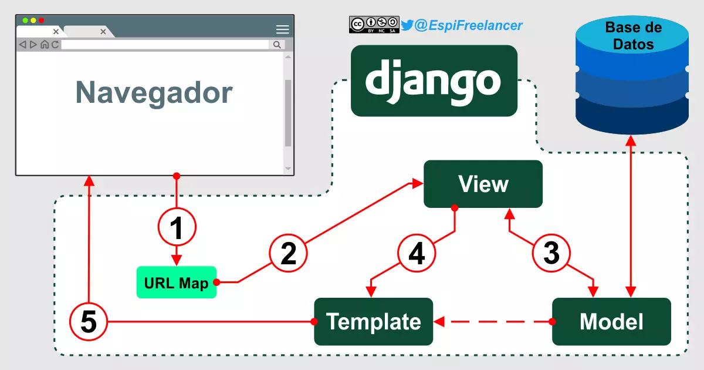

# Desarrollo de un sistema de gestión académica para la UNEXCA

---

Se solicita un sistema informático para matriculación y control de notas de la Universidad Nacional Experimental de la Gran Caracas.

---

# Requerimientos del sistema

* Sistema de inicio de sesión
* Gestión de usuarios
* Configuración de pénsum académico
* Secciones dinámicas según el rol del usuario
* Inscripción de materias

---

# Software empleado

---

# El backend

---


* Framework de desarrollo web escrito en Python
* Amplia biblioteca de código
* API de base de datos robusta
* Código sencillo, fácil de leer y escribir

---

# La base de datos

---


* Sistema de gestión de bases de datos relacionales
* Software libre y de código abierto
* Derivado de MySQL

---

# El frontend

---


* Framework de desarrollo web front-end
* Plantillas de diseño basadas en HTML y CSS
* Amplia biblioteca de componentes

---

# Trabajo colaborativo

---


* Software de control de versiones
* Historial y trazabilidad
* Trabajo en paralelo
* Integración con plataformas de alojamiento

---


* Plataforma de alojamiento en la nube
* Facilita el desarrollo colaborativo

---

# El Sistema

---

# Patrón MVT

*Model - View - Template*

---

# Modelo

* Se encarga del acceso a la base de datos
* Contiene toda la información sobre los datos

---

# Vista

* Determina qué datos serán visualizados
* Se presenta en forma de funciones o clases

---

# Plantilla

* Archivos basados en HTML
* Recibe los datos de la vista como parámetros

---



---

# Modelos

* Son la fuente única y definitiva de información sobre los datos
* Contienen los campos y comportamientos esenciales de los datos

---

# ORM

* **Mapeador Relacional de Objetos** de Django
* Permite interactuar con la base de datos

---

```python
class Carrera(models.Model):
    nombre = models.CharField('carrera', max_length=150, unique=True)


class Materia(models.Model):
    nombre = models.CharField('materia', max_length=150, unique=True)


class Seccion(models.Model):
    codigo  = models.CharField('código de sección', max_length=10)
    carrera = models.ForeignKey(Carrera, on_delete=models.CASCADE)

    def __str__(self):
        return f'{self.carrera} {self.codigo}'
```

---

```python
class Usuario(AbstractUser):
    roles = [
        (1, 'Administrador'),
        (2, 'Docente'),
        (3, 'Alumno'),
    ]

    username   = models.IntegerField('cédula', unique=True)
    rol        = models.IntegerField('rol', choices=roles, default=roles[2][0])
    last_name  = models.CharField('apellidos', max_length=150)
    first_name = models.CharField('nombres', max_length=150)

    def __str__(self):
        return f'{self.first_name} {self.last_name}'.strip()

    def get_correo(self):
        correo = self.email
        return correo if correo else '---'
```

---

```python
class Clase(models.Model):
    dias_de_la_semana = [
        ('lun', 'Lunes'),
        ('mar', 'Martes'),
        ('mie', 'Miércoles'),
        ('jue', 'Jueves'),
        ('vie', 'Viernes'),
        ('sab', 'Sábado')
    ]

    materia     = models.ForeignKey(Materia)
    docente     = models.ForeignKey(Usuario, limit_choices_to={ 'rol': 2 })
    seccion     = models.ForeignKey(Seccion)
    dia         = models.CharField('días', max_length=50, choices=dias_de_la_semana)
    hora_inicio = models.TimeField('hora de inicio')
    hora_fin    = models.TimeField('hora de fin')
    aula        = models.IntegerField('aula')
```

---

# Vistas

* Funciones o clases que procesan las solicitudes HTTP y devuelven respuestas.
* Se definen en el archivo `views.py`.

---

# Vistas basadas en funciones

---

```python
@login_required
def home(request):
    match request.user.rol:
        case 1:
            return redirect('admin/')
        case 2:
            return redirect('docente_clases')
        case 3:
            return redirect('alumno_clases')
        case _:
            return redirect('login')
```

---

# Vistas basadas en clases

---

```python
class RoleTestMixin(LoginRequiredMixin, UserPassesTestMixin):
    def test_func(self):
        return self.request.user.rol == self.required_role

    def handle_no_permission(self):
        return redirect('home')


class DocenteClases(RoleTestMixin, ListView):
    required_role = 2
    model = models.Clase
    template_name = 'user/teacher/classes.html'

    def get_queryset(self):
        return models.Clase.objects.filter(docente=self.request.user)
```

---

# Rutas (URLs)

* Utilizadas para mapear las direcciones web de la aplicación a las vistas correspondientes.
* Se definen en el archivo `urls.py`.

---

```python
from django.urls import path
from . import views

urlpatterns = [
    path('', views.home, name='home'),
    path('u/2/clases/', views.DocenteClases.as_view(), name='docente_clases'),
]
```

---

# Plantillas

* Documentos en HTML y etiquetas especiales de Django.
* Renderizan información proveniente de la vista.

---

# Para qué sirven

* Separan la parte lógica de la parte visual de la página.
* Cuentan con un diccionario de contexto.
* Permiten la inclusión de bloques, variables, filtros y etiquetas personalizadas.

---

# Cómo se utilizan

* Se crean en el directorio `templates/`, en el directorio de la aplicación.
* Dentro del archivo se crea la estructura de la plantilla con HTML.
* Se agregan etiquetas especiales de Django para incluir contenido dinámico.

---

base.html

```html
<!DOCTYPE html>
<html lang="es">
  <head>
    
    <meta charset="UTF-8">
    <meta name="viewport" content="width=device-width, initial-scale=1">
    <title> - UNEXCA</title>
    <link rel="icon" type="image/png" href="">
    <link rel="stylesheet" href="">
</head>

</html>
```

---

# Herencia

* Es la capacidad de extender o heredar el código de otra plantilla.
* Permite reutilizar la estructura, evitando la repetición de código.

---

main.html

```html



<body>
  <nav>
    <a href="">Mis clases</a>
    <a href="">Solicitudes</a>
    <a href="">Mi perfil</a>
  </nav>
  <main>
    <!-- Contenido principal -->
  </main>
</body>

```

---

# Variables enviadas desde las vistas

* Las vistas pueden enviar un diccionario (contexto) hacia las plantillas.
* Las plantillas usan ese contexto para cargar los parámetros instanciados.

---

views.py

```python
class DocenteClases(RoleTestMixin, ListView):
    required_role = 2
    model = models.Clase
    template_name = 'user/teacher/classes.html'

    def get_queryset(self):
        return models.Clase.objects.filter(docente=self.request.user)
```

---

teacher_classes.html

```html

<div>
  <h2>{{ clase.materia }} - {{ clase.seccion }}</h2>
  <ul>
    <li>Sección:      {{ clase.seccion }}</li>
    <li>Dia de clase: {{ clase.get_dia_display }}</li>
    <li>Hora inicio:  {{ clase.hora_inicio|time:"g:i A" }}</li>
    <li>Hora fin:     {{ clase.hora_fin|time:"g:i A" }}</li>
    <li>Aula:         {{ clase.aula }}</li>
  </ul>
  <a href="">Ver matrícula</a>
</div>

```

---

# Ciclos y condicionales

* Se pueden utilizar ciclos y condicionales en las plantillas de Django.
* Se usan para controlar la lógica y presentación de los datos.
* Pueden recorrer listas y variables del contexto.

---

teacher_classes.html

```html


<div>
  <h2>{{ clase.materia }} - {{ clase.seccion }}</h2>
  <ul>
    <li>Sección:      {{ clase.seccion }}</li>
    <li>Dia de clase: {{ clase.get_dia_display }}</li>
    <li>Hora inicio:  {{ clase.hora_inicio|time:"g:i A" }}</li>
    <li>Hora fin:     {{ clase.hora_fin|time:"g:i A" }}</li>
    <li>Aula:         {{ clase.aula }}</li>
  </ul>
  <a href="">Ver matrícula</a>
</div>


<p>Usted no tiene clases asignadas</p>

```

---

# Demostración del sistema

---

# Nuestra experiencia desarrollando el sistema

---

Proyecto disponible en GitHub:

https://github.com/newmanls/10132-Proyecto


